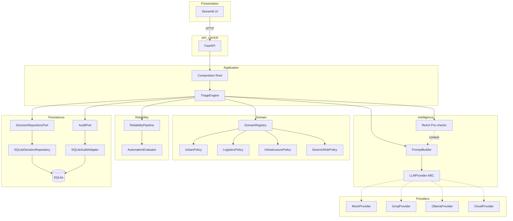
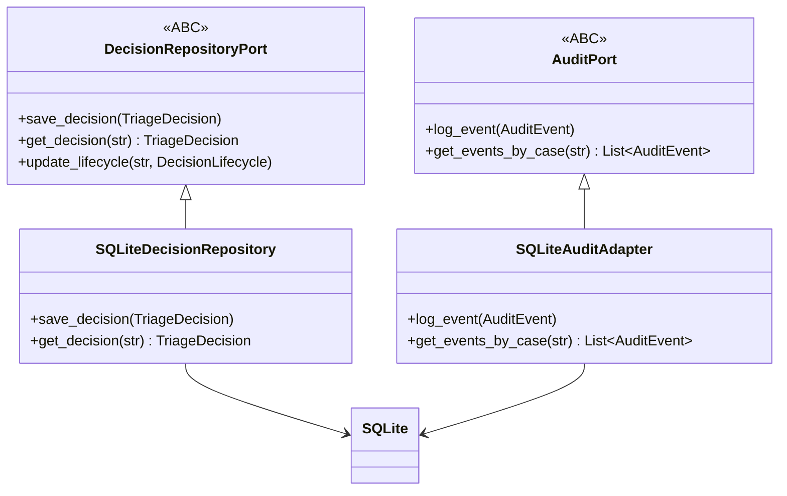
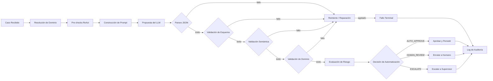
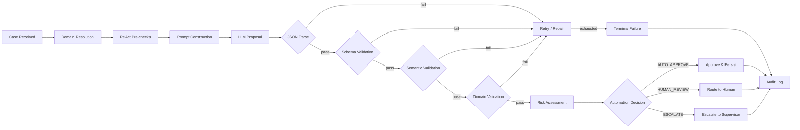

<p align="center">
  
</p>

<h1 align="center">CASE</h1>
<h3 align="center">Case Assessment and Structured Evaluation</h3>

<p align="center">
  Orquestación conservadora de decisiones IA para flujos operativos.
</p>

<p align="center">
  <a href="https://github.com/juandelaf1/CASE/releases/tag/v1.0.0"></a>
  <a href="https://opensource.org/licenses/MIT"></a>
  
  
  
</p>

<p align="center">
  <strong>692 passed (deterministic) · 7 skipped · 0 failed</strong><br>
  <sub>ruff 0 errors · mypy 0 errors · 93 source files</sub><br>
  <sub>Live tests (Groq/Ollama): require API key and running server</sub>
</p>

---

<p align="center">
  <a href="#español">🇪🇸 Español</a> · <a href="#english">🇬🇧 English</a>
</p>

---

# Español

## ¿Qué es CASE?

CASE es una plataforma de orquestación de decisiones IA, de dominio agnóstico y de proveedor agnóstico. Transforma casos operativos no estructurados en decisiones estructuradas, validadas y respaldadas por evidencia — con supervisión humana enforce por diseño.

> **El LLM propone. CASE valida, evalúa y gobierna la decisión.**

El LLM genera una propuesta estructurada. CASE la valida, evalúa fiabilidad y riesgo, determina la ruta de gobernanza y aplica supervisión humana cuando corresponde. La salida cruda del modelo nunca se confía directamente. Cada decisión pasa por validación multietapa, verificaciones de política específicas del dominio, evaluación de riesgo y enrutamiento conservador antes de persistir.

**Qué es CASE:**
- Un pipeline de validación que nunca confía en la salida cruda del LLM
- Un sistema de automatización basado en riesgo con supervisión humana (HITL)
- Un framework de dominio agnóstico que soporta múltiples dominios operativos
- Un sistema de decisiones auditable con trazabilidad completa

**Qué NO es CASE:**
- No es un modelo fine-tuned ni un sistema RAG
- No es un framework de agentes
- No es un despliegue en producción
- No es un tomador de decisiones autónomo

---

## ¿Por qué CASE?

Los grandes modelos de lenguaje son sistemas probabilistas. Su salida puede ser inconsistente, alucinada o sutilmente errónea de formas difíciles de detectar automáticamente. Enrutar directamente la salida cruda del LLM a decisiones operativas introduce un riesgo inaceptable.

CASE aborda esto introduciendo una capa de orquestación estructurada:

1. **Recibir** un caso operativo con evidencia
2. **Obtener** una propuesta del modelo mediante el puerto LLMProvider
3. **Validar** la salida a través de restricciones de esquema, semántica y dominio
4. **Reintentar** en fallos transitorios y de validación con backoff exponencial
5. **Evaluar** el riesgo de automatización usando políticas específicas del dominio
6. **Enrutar** al resultado apropiado: auto-aprobación, revisión humana o escalado
7. **Persistir** la decisión con trazabilidad completa de auditoría
8. **Habilitar** override humano en cualquier punto del ciclo de vida

El insight arquitectónico es que **la incertidumbre debería aumentar la intervención humana, no disminuirla**. Cuando la confianza baja, la evidencia es escasa o el riesgo aumenta, CASE enruta hacia el juicio humano en lugar de la acción automatizada.

---

## Principios de Diseño

| Principio | Implementación |
|-----------|---------------|
| **Arquitectura hexagonal** | Patrón Puertos y Adaptadores — la lógica core depende de interfaces ABC, no de implementaciones |
| **Neutralidad de proveedores** | Los providers LLM implementan el puerto `LLMProvider`; cambiar requiere cero cambios en el core |
| **Abstracción de políticas de dominio** | Cada dominio registra un `DomainPolicy` y `AutomationPolicy`; el core permanece agnóstico al dominio |
| **Validación basada en contratos** | Todos los flujos de datos pasan por esquemas Pydantic v2 con tipado estricto |
| **Pipeline de fiabilidad** | Validación multietapa: parse → esquema → semántica → dominio → reintento → reparación |
| **Enrutamiento basado en riesgo** | Tres resultados: `AUTO_APPROVE`, `HUMAN_REVIEW`, `ESCALATE` — conservador por defecto |
| **Humano en el circuito** | Ciclo de vida completo de decisiones con operaciones de aprobar, rechazar, modificar y escalar |
| **Auditoría** | Cada evento registrado a través de `AuditPort` con trazabilidad completa |
| **Evaluación determinista** | Evaluación sintética con métricas reproducibles, sin dependencias externas |
| **Invarianza contrafactual** | Testing de sesgos verifica que las decisiones permanezcan estables ante cambios de atributos irrelevantes |

---

## Arquitectura



> **Conectado vs. Aislado:** Este diagrama muestra la **ruta de ejecución conectada** — componentes cableados vía `composition.py` y ejecutados por `TriageEngine`. Las líneas punteadas indican que los providers son implementaciones alternativas del ABC `LLMProvider`, seleccionados al inicio mediante la variable de entorno `CASE_PROVIDER`. CASE también contiene módulos implementados y testeados que **no están conectados** a este pipeline. Ver [Estado del Proyecto](#estado-del-proyecto) para la distinción completa.




---

## Flujo de Decisión



### Enrutamiento de Decisiones

| Resultado | Condición | Comportamiento |
|-----------|-----------|----------------|
| `AUTO_APPROVE` | Riesgo bajo, esquema válido, alta confianza, evidencia suficiente | Decisión persistida, auditoría registrada |
| `HUMAN_REVIEW` | Riesgo medio, evidencia ambigua, confianza bajo umbral | Enrutado a cola de revisión humana |
| `ESCALATE` | Riesgo crítico, violación de política, fallo de esquema tras reintentos | Escalado a supervisor |

**Conservador por diseño:** Cuando la incertidumbre o el riesgo aumenta, CASE prefiere la revisión humana sobre la automatización. El sistema está diseñado para errar del lado de la precaución.

---

## Estado del Proyecto

> Verificado contra el estado del repositorio. Última verificación: 2026-09-17.

### Core Conectado

Estos componentes están cableados al sistema en ejecución vía `composition.py` y `TriageEngine`:

| Componente | Ubicación | Estado |
|------------|-----------|--------|
| Contratos (esquemas Pydantic v2) | `contracts/` | Conectado |
| Puertos (6 interfaces ABC) | `ports/` | Conectado |
| DomainRegistry (4 dominios) | `domain/registry.py` | Conectado |
| TriageEngine | `application/engine.py` | Conectado |
| ReliabilityPipeline | `reliability/pipeline.py` | Conectado |
| AutomationEvaluator | `reliability/automation.py` | Conectado |
| Pre-checks ReAct | `react/__init__.py` | Conectado |
| PromptBuilder | `prompts/builder.py` | Conectado |
| MockProvider (default) | `providers/mock.py` | Conectado |
| GroqProvider | `providers/groq.py` | Conectado |
| OllamaProvider | `providers/ollama.py` | Conectado |
| CloudProvider | `providers/cloud.py` | Conectado |
| CostModel | `evaluation/cost.py` | Conectado |
| Persistencia SQLite | `case_infra/persistence/` | Conectado |
| API FastAPI (11 endpoints) | `case_api/api/v1/app.py` | Conectado |
| UI Streamlit | `streamlit_app/` | Conectado |
| Framework de evaluación | `evaluation/` | Conectado |

### Implementado pero Aislado

Estos módulos están implementados y testeados, pero **no están cableados** al pipeline principal:

| Módulo | Archivos | Tests | Propósito |
|--------|----------|-------|-----------|
| Logistics Intelligence | 8 archivos en `domain/` | 26 | Clasificación de envíos, enrutamiento, matching de carriers |
| ML Adaptation | 7 archivos en `ml/` | 26 | Abstracciones de entrenamiento, pipeline de datasets |
| Specialist Models | 2 archivos en `ml/` | 21 | Clasificación/riesgo/enrutamiento basado en keywords |
| Hybrid Decision Engine | 1 archivo en `hybrid/` | 18 | Combinación de decisiones multi-fuente |
| Real Estate Domain | 1 archivo en `domain/` | 28 | Política de dominio (no registrado) |
| Governance | 1 archivo en `governance/` | 28 | Seguridad, compliance, RBAC |
| Production | 1 archivo en `production/` | 28 | Circuit breaker, rate limiter, health checks |

Estos demuestran la extensibilidad de la arquitectura. Cablearlos requiere una decisión arquitectónica explícita con justificación documentada.

---

## Inicio Rápido

### Prerrequisitos

- Python 3.11+

### Instalación

```bash
git clone https://github.com/juandelaf1/CASE.git
cd CASE
python -m venv .venv
source .venv/bin/activate        # Linux/Mac
# .venv\Scripts\activate         # Windows
pip install -e ".[dev]"
```

### Verificar

```bash
pytest tests/ -q --ignore=tests/unit/test_streamlit_client.py
# Esperado: 692 passed, 7 skipped

ruff check src
# Esperado: All checks passed

mypy src --ignore-missing-imports
# Esperado: Success: no issues found in 93 source files
```

### Ejecutar la API

```bash
uvicorn case_api.api.v1.app:app --reload --host 0.0.0.0 --port 8000
# Docs API: http://localhost:8000/docs
```

### Ejecutar la UI

```bash
streamlit run streamlit_app/app.py
```

### Ejecutar un Demo

```bash
python examples/demo_auto_approve.py
```

---

## Guía de Demo — 5/10 Minutos

### Paso 1 — Decision Center

Abre Streamlit y navega a Decision Center. La sección hero explica:

> CASE no delega ciegamente la decisión al LLM.

Muestra la visualización del pipeline: CASE_RECEIVED → LLM_PROPOSAL → RELIABILITY → RISK → GOVERNANCE → AUDIT.

### Paso 2 — Triage con Groq

Ejecuta un caso en Triage con el provider Groq. Muestra:

- **PROPUESTA DEL LLM** — salida cruda del LLM con confianza, decisión, urgencia
- **GOBERNANZA CASE** — la ruta de gobernanza determinada por CASE (AUTO_APPROVE / HUMAN_REVIEW / ESCALATE)

Explica: *el modelo propone; CASE valida y determina la ruta.*

### Paso 3 — Mismo caso con Ollama

Repite el mismo caso con Ollama. Muestra que dos providers pueden producir resultados diferentes y CASE aplica su pipeline de gobernanza sobre ambos.

### Paso 4 — Comparison

Abre Comparison, selecciona la pestaña EN VIVO. Ejecuta el mismo input contra Groq y Ollama. Muestra:
- resultado por separado
- confianza
- latencia (~255ms vs ~18s)
- tokens
- errores si los hubiera

### Paso 5 — Human Review

Envía un caso a HUMAN_REVIEW. Ejecuta una acción HITL (aprobar/rechazar/modificar/escalar).

### Paso 6 — Audit Trail

Muestra los eventos de auditoría generados por la acción HITL. Muestra timestamps, actores, tipos de eventos.

### Paso 7 — Control Room

Muestra health checks reales de FastAPI, SQLite, Groq, Ollama. Muestra métricas de decisiones por lifecycle.

### Scripts de Demo

El directorio `examples/` contiene scripts de demo deterministas:

| Script | Escenario | Resultado Esperado |
|--------|-----------|-------------------|
| `demo_auto_approve.py` | Caso logístico de bajo riesgo | AUTO_APPROVE |
| `demo_human_review.py` | Caso ambiguo | HUMAN_REVIEW |
| `demo_escalate.py` | Caso crítico | ESCALATE |
| `demo_invalid_output.py` | Evidencia vacía | Fallo terminal (validación de dominio) |
| `demo_hitl_lifecycle.py` | Flujo HITL completo | Aprobar → Rechazar → Modificar |
| `demo_all_domains.py` | Los 4 dominios | Enrutamiento específico por dominio |

```bash
python examples/demo_auto_approve.py
```

---

## Endpoints de API

| Endpoint | Método | Descripción |
|----------|--------|-------------|
| `/health` | GET | Health check |
| `/domains` | GET | Listar dominios registrados |
| `/api/v1/triage` | POST | Enviar un caso para triage |
| `/api/v1/audit/{case_id}` | GET | Obtener eventos de auditoría de un caso |
| `/api/v1/hitl/pending` | GET | Listar decisiones pendientes de revisión humana |
| `/api/v1/hitl/{decision_id}` | GET | Obtener una decisión específica |
| `/api/v1/hitl/{decision_id}/under-review` | POST | Iniciar revisión humana |
| `/api/v1/hitl/{decision_id}/approve` | POST | Aprobar una decisión |
| `/api/v1/hitl/{decision_id}/reject` | POST | Rechazar una decisión |
| `/api/v1/hitl/{decision_id}/escalate` | POST | Escalar una decisión |
| `/api/v1/hitl/{decision_id}/modify` | POST | Modificar una decisión |

---

## Evaluación

CASE incluye un framework de evaluación determinista para medir la calidad de decisiones.

### Alcance

- **Evaluation** (streamlit_app/views/evaluation.py) → datos sintéticos con MockProvider
- **Counterfactual** (streamlit_app/views/counterfactual.py) → testing controlado de sesgos
- **Comparison LIVE** (streamlit_app/views/comparison.py) → providers reales cuando están disponibles

Las evaluaciones sintéticas y los resultados de MockProvider están claramente etiquetados como SIMULADO / EN VIVO en la UI. Ningún resultado mock se presenta como live.

### Métricas

- Precisión de decisión
- Precisión de urgencia
- Confianza promedio
- Tiempo de procesamiento
- Tasa de errores
- Tasa de consistencia de pares (sesgo)
- Tasa de invarianza de decisión (sesgo)
- Tasa de invarianza de enrutamiento (sesgo)

### Evaluación de Sesgos

10 pares contrafactuales testean si cambios de atributos irrelevantes (nombre de proveedor, nombre de cliente, redacción) alteran los resultados de decisión. Actualmente cubre solo el dominio de Logística.

### Alcance

La evaluación usa datos sintéticos con MockProvider. Los resultados demuestran corrección arquitectónica, no precisión productiva. La validación con LLM real se realiza separadamente vía comparación LIVE.

---

## Providers

| Provider | Tipo | Caso de Uso | E2E Verificado | Selección |
|----------|------|-------------|----------------|-----------|
| MockProvider | Determinista | Testing, demo, evaluación | Sí (tests unitarios) | `CASE_PROVIDER=mock` (default) |
| GroqProvider | Cloud API | Inferencia real (qwen/qwen3.8-27b) | Sí (LIVE) | `CASE_PROVIDER=groq` |
| OllamaProvider | LLM Local | Desarrollo, comparación offline | Sí (LIVE) | `CASE_PROVIDER=ollama` |
| CloudProvider | Compatible OpenAI | Producción (GPT-4o-mini) | Implementación correcta | `CASE_PROVIDER=cloud` |

Todos los providers implementan el puerto `LLMProvider`. El provider se selecciona al inicio mediante la variable de entorno `CASE_PROVIDER`. Cambiar providers requiere cero cambios en la lógica core.

### Comparación de Providers (Requisito Académico)

La vista Comparison (streamlit_app/views/comparison.py) soporta comparación de decisiones entre providers. Para comparación en vivo:

1. **Groq**: Ejecuta triage con `CASE_PROVIDER=groq` — inferencia real de API
2. **Ollama**: Ejecuta triage con `CASE_PROVIDER=ollama` — requiere servidor Ollama local

La vista Comparison agrupa automáticamente las decisiones por provider y muestra:
- Resultado de clasificación (approve/reject/escalate)
- Nivel de urgencia
- Puntuación de confianza
- Uso de tokens y coste
- Latencia

### Rendimiento Observado (LIVE)

| Provider | Modelo | Latencia | Notas |
|----------|--------|----------|-------|
| Groq | qwen/qwen3.8-27b | ~255ms | Cloud API, baja latencia |
| Ollama | llama3.2 | ~18s | Local, mayor latencia |

Ambos providers produjeron decisiones estructuradas válidas para el mismo input. CASE aplica su pipeline de gobernanza independientemente de la latencia o fuente del provider.

### Cambio de Providers

```python
from case_core.composition import create_app_dependencies
from case_core.providers.ollama import OllamaProvider
from case_core.providers.cloud import CloudProvider

# En composition.py, reemplaza:
#   provider = MockProvider()
# por:
#   provider = OllamaProvider(model="llama3.2")
# o:
#   provider = CloudProvider(api_key="your-key")
```

---

## Dominios

| Dominio | Política | Enrutamiento | Automatización |
|---------|----------|--------------|----------------|
| **Logística** | Completa | 6 tipos de incidentes | LogisticsAutomationPolicy |
| **Operaciones Urbanas** | Parcial | Urgencia por keywords | DefaultAutomationPolicy |
| **Infraestructura** | Parcial | Urgencia por keywords | DefaultAutomationPolicy |
| **Riesgo Sísmico** | Parcial | API USGS | SeismicAutomationPolicy |

### Domain Pack de Logística

- **Tipos de incidente:** delivery_delay, delivery_failure, stock_issue, warehouse_delay, damaged_goods, transport_disruption
- **Departamentos:** logistics, warehouse, fleet, operations, customer_service
- **Automatización:** Automatización completa basada en riesgo con reglas específicas del dominio

### Operaciones Urbanas e Infraestructura

- Validación de evidencia: requiere items de evidencia
- Clasificación de urgencia: basada en keywords
- Automatización: DefaultAutomationPolicy (conservadora, `HUMAN_REVIEW` por defecto)

---

## Testing

### Snapshot de Calidad

| Verificación | Resultado |
|-------------|-----------|
| pytest (determinista) | 692 passed, 7 skipped, 0 failed |
| ruff | 0 errors (src) |
| mypy | 0 errors (93 source files) |

### Clasificación de Tests

| Categoría | Suites | Descripción |
|-----------|--------|-------------|
| Unit | domain, triage_engine, prompt_builder, reliability | Tests del pipeline core |
| Contract | contracts, ports, mock_provider, ollama_provider, cloud_provider | Validación de interfaces/esquemas |
| Integration | api, ollama_integration | Tests E2E de API |
| Behavioral | behavioral | 30 escenarios conductuales (BS001-BS030) |
| Security | security | 31 tests, 10 escenarios de ataque |
| Bias | bias_evaluation | Análisis de pares contrafactuales |
| Regression | regression | Casos normales, borde, fallo, inyección |
| Persistence | sqlite | Tests de adaptadores SQLite |
| Boundary | streamlit_boundary | Límite de integración Streamlit |
| Isolated | governance, hybrid_decision, ml_adaptation, production, real_estate_domain, specialist_models | Tests de módulos aislados |

### Ejecución de Tests

```bash
# Todos los tests
pytest tests/ -q --ignore=tests/unit/test_streamlit_client.py

# Suite específica
pytest tests/unit/test_behavioral.py -v

# Con cobertura
pytest tests/ --cov=src --cov-report=term-missing
```

---

## Limitaciones

### Alcance (por diseño)

| Limitación | Estado | Notas |
|------------|--------|-------|
| Proyecto portfolio/investigación | Por diseño | No es un sistema en producción |
| Sin autenticación/autorización | Por diseño | No necesario para el alcance del demo |
| Sin testing de rendimiento/carga | Por diseño | No necesario para el alcance del demo |
| Solo SQLite | Por diseño | Single-tenant, sin acceso concurrente |

### Evaluación

| Limitación | Estado | Impacto |
|------------|--------|---------|
| MockProvider como fuente principal de evidencia | Activo | Todas las evaluaciones usan respuestas sintéticas |
| Comportamiento real del LLM no validado | Activo | Seguridad/sesgos testeados solo con MockProvider |
| Pares de sesgos solo en Logística | Activo | 0 pares para Urbano/Infraestructura |
| Dataset sintético (15 casos) | Activo | Demuestra el framework, no precisión productiva |

### Cobertura de Dominios

| Limitación | Estado | Impacto |
|------------|--------|---------|
| Automatización genérica para Urbano/Infraestructura | Activo | DefaultAutomationPolicy, no específica del dominio |
| Sin lógica de enrutamiento para Urbano/Infraestructura | Activo | Usa clasificación de urgencia por keywords |

### Problemas Conocidos

| Problema | Estado | Impacto |
|----------|--------|---------|
| Audit trail con `CASE_RECEIVED` duplicado | Observado | El engine registra la recepción del caso dos veces en un flujo. Cosmético, no afecta la corrección. |
| Groq `response_schema={}` falla | Pre-existente | Groq requiere "json" en messages para formato json_object. Los schemas reales de CASE funcionan correctamente. |
| Latencia de Ollama significativamente mayor que Groq | Por diseño | Local vs cloud. Útil para comparación de arquitectura, no es un defecto. |

### Módulos Aislados

Los siguientes módulos están implementados y testeados pero **no están conectados** al pipeline en ejecución:

| Módulo | Descripción |
|--------|-------------|
| Logistics Intelligence | Clasificación de envíos, enrutamiento, matching de carriers |
| ML Adaptation | Abstracciones de entrenamiento, pipeline de datasets |
| Specialist Models | Clasificación/riesgo/enrutamiento basado en keywords |
| Hybrid Decision Engine | Combinación de decisiones multi-fuente |
| Real Estate Domain | Política de dominio (no registrado en DomainRegistry) |
| Governance | Seguridad, compliance, control de acceso |
| Production | Circuit breaker, rate limiter, health checks |

No están rotos ni incompletos. Son implementaciones independientes que demuestran la extensibilidad arquitectónica. Cablearlos requiere una decisión explícita.

---

## Estructura del Proyecto

```text
CASE/
├── src/
│   ├── case_core/
│   │   ├── application/     # TriageEngine (orquestador)
│   │   ├── contracts/       # Esquemas Pydantic v2 (9 archivos)
│   │   ├── domain/          # DomainRegistry, DomainPacks
│   │   ├── evaluation/      # Runner, métricas, reportes
│   │   ├── ports/           # Interfaces ABC (6 puertos)
│   │   ├── prompts/         # PromptBuilder
│   │   ├── providers/       # Mock, Ollama, Cloud
│   │   ├── reliability/     # Pipeline, evaluador de automatización
│   │   └── composition.py   # Cableado de dependencias
│   ├── case_api/
│   │   └── api/v1/          # Endpoints FastAPI
│   └── case_infra/
│       └── persistence/     # Adaptadores SQLite
├── tests/
│   ├── unit/                # 18 archivos de test
│   └── integration/         # 2 archivos de test
├── examples/                # 6 scripts de demo
├── streamlit_app/           # UI Streamlit
├── docs/                    # Arquitectura, estado, roadmap
├── pyproject.toml           # Configuración del proyecto
└── README.md                # Este archivo
```

---

## Documentación

| Documento | Propósito |
|-----------|-----------|
| [ARCHITECTURE.md](docs/ARCHITECTURE.md) | Arquitectura técnica y descripciones de capas |
| [DEVELOPMENT_STATUS.md](docs/DEVELOPMENT_STATUS.md) | Estado detallado de implementación y matriz de tests |
| [ROADMAP.md](docs/ROADMAP.md) | Fases, hitos y planificación futura |
| [DECISION_LOG.md](docs/DECISION_LOG.md) | Registro de decisiones técnicas significativas (D001-D010) |
| [CAPABILITY_AUDIT.md](docs/CAPABILITY_AUDIT.md) | Auditoría de módulos aislados con propuestas de integración |
| [CHANGELOG.md](CHANGELOG.md) | Historial completo de versiones |
| [RELEASES.md](docs/RELEASES.md) | Hitos de release y estado |
| [AGENT_CONTEXT.md](docs/AGENT_CONTEXT.md) | Estado del repositorio para agentes IA y contribuidores |

---

## Presentación

La presentación académica del proyecto está disponible en:

[`docs/presentation/CASE_Decision_Architecture.pptx`](docs/presentation/CASE_Decision_Architecture.pptx)

---

## Configuración

### Variables de Entorno

| Variable | Default | Descripción |
|----------|---------|-------------|
| `CASE_PROVIDER` | `mock` | Provider LLM: `mock`, `groq`, `ollama`, `cloud` |
| `CASE_DB_PATH` | `case_audit.db` | Ruta de la base de datos SQLite |
| `OLLAMA_BASE_URL` | `http://localhost:11434` | URL del servidor Ollama |
| `OLLAMA_MODEL` | `llama3.2` | Nombre del modelo Ollama |
| `CASE_GROQ_API_KEY` | — | API key de Groq (requerida para `groq`) |
| `CASE_CLOUD_API_KEY` | — | API key del provider cloud (requerida para `cloud`) |

---

## Licencia

MIT — Ver [LICENSE](LICENSE) para detalles.

---

# English

## What is CASE?

CASE is a domain-agnostic, provider-agnostic AI decision orchestration platform. It transforms unstructured operational cases into structured, validated, evidence-backed decisions — with human oversight enforced by design.

> **El LLM propone. CASE valida, evalúa y gobierna la decisión.**

The LLM generates a structured proposal. CASE then validates it, evaluates reliability and risk, determines the governance route, and enforces human oversight when appropriate. Raw model output is never trusted directly. Every decision passes through multi-stage validation, domain-specific policy checks, risk evaluation, and conservative routing before persistence.

**What CASE is:**
- A validation pipeline that never trusts raw LLM output
- A risk-based automation system with human oversight (HITL)
- A domain-agnostic framework supporting multiple operational domains
- An auditable decision system with full traceability

**What CASE is not:**
- Not a fine-tuned model or RAG system
- Not an agent framework
- Not a production deployment
- Not an autonomous decision-maker

---

## Why CASE?

Large language models are probabilistic systems. Their output can be inconsistent, hallucinated, or subtly wrong in ways that are difficult to detect automatically. Directly routing raw LLM output to operational decisions introduces unacceptable risk.

CASE addresses this by introducing a structured orchestration layer:

1. **Receive** an operational case with evidence
2. **Obtain** a model proposal via the LLM provider port
3. **Validate** the output through schema, semantic, and domain constraints
4. **Retry** on transient and validation failures with exponential backoff
5. **Evaluate** automation risk using domain-specific policies
6. **Route** to the appropriate outcome: auto-approve, human review, or escalation
7. **Persist** the decision with full audit trail
8. **Enable** human override at any point in the lifecycle

The architectural insight is that **uncertainty should increase human involvement, not decrease it**. When confidence drops, evidence is thin, or risk rises, CASE routes toward human judgment rather than automated action.

---

## Core Design Principles

| Principle | Implementation |
|-----------|---------------|
| **Hexagonal architecture** | Ports and Adapters pattern — core logic depends on ABC interfaces, not implementations |
| **Provider neutrality** | LLM providers implement `LLMProvider` port; swapping requires zero core changes |
| **Domain-policy abstraction** | Each domain registers a `DomainPolicy` and `AutomationPolicy`; core remains domain-agnostic |
| **Contract-driven validation** | All data flows through Pydantic v2 schemas with strict type enforcement |
| **Reliability pipeline** | Multi-stage validation: parse → schema → semantic → domain → retry → repair |
| **Risk-based routing** | Three outcomes: `AUTO_APPROVE`, `HUMAN_REVIEW`, `ESCALATE` — conservative by default |
| **Human-in-the-loop** | Full decision lifecycle with approve, reject, modify, and escalate operations |
| **Auditability** | Every event logged through `AuditPort` with full traceability |
| **Deterministic evaluation** | Synthetic evaluation with reproducible metrics, no external dependencies |
| **Counterfactual invariance** | Bias testing verifies decisions remain stable across irrelevant attribute changes |

---

## Architecture


> **Connected vs. Isolated:** This diagram shows the **connected execution path** — components wired via `composition.py` and executed by `TriageEngine`. Dashed lines indicate that providers are alternative implementations of the `LLMProvider` ABC, selected at startup via `CASE_PROVIDER` env var. CASE also contains implemented and tested modules that are **not** connected to this pipeline. See [Project Status](#project-status) for the complete distinction.


---

## Decision Flow



### Decision Routing

| Outcome | Condition | Behavior |
|---------|-----------|----------|
| `AUTO_APPROVE` | Low risk, valid schema, high confidence, sufficient evidence | Decision persisted, audit logged |
| `HUMAN_REVIEW` | Medium risk, ambiguous evidence, confidence below threshold | Routed to human review queue |
| `ESCALATE` | Critical risk, policy violation, schema failure after retries | Escalated to supervisor |

**Conservative by design:** When uncertainty or risk increases, CASE prefers human review over automation. The system is designed to err on the side of caution.

---

## Project Status

> Verified against repository state. Last checked: 2026-09-17.

### Connected Core

These components are wired into the running system via `composition.py` and `TriageEngine`:

| Component | Location | Status |
|-----------|----------|--------|
| Contracts (Pydantic v2 schemas) | `contracts/` | Connected |
| Ports (6 ABC interfaces) | `ports/` | Connected |
| DomainRegistry (4 domains) | `domain/registry.py` | Connected |
| TriageEngine | `application/engine.py` | Connected |
| ReliabilityPipeline | `reliability/pipeline.py` | Connected |
| AutomationEvaluator | `reliability/automation.py` | Connected |
| ReAct pre-checks | `react/__init__.py` | Connected |
| PromptBuilder | `prompts/builder.py` | Connected |
| MockProvider (default) | `providers/mock.py` | Connected |
| GroqProvider | `providers/groq.py` | Connected |
| OllamaProvider | `providers/ollama.py` | Connected |
| CloudProvider | `providers/cloud.py` | Connected |
| CostModel | `evaluation/cost.py` | Connected |
| SQLite persistence | `case_infra/persistence/` | Connected |
| FastAPI API (11 endpoints) | `case_api/api/v1/app.py` | Connected |
| Streamlit UI | `streamlit_app/` | Connected |
| Evaluation framework | `evaluation/` | Connected |

### Implemented but Isolated

These modules are implemented, tested, but **not wired** into the main pipeline:

| Module | Files | Tests | Purpose |
|--------|-------|-------|---------|
| Logistics Intelligence | 8 files in `domain/` | 26 | Shipment classification, routing, carrier matching |
| ML Adaptation | 7 files in `ml/` | 26 | Training abstractions, dataset pipeline |
| Specialist Models | 2 files in `ml/` | 21 | Keyword-based classification/risk/routing |
| Hybrid Decision Engine | 1 file in `hybrid/` | 18 | Multi-source decision combination |
| Real Estate Domain | 1 file in `domain/` | 28 | Domain policy (not registered) |
| Governance | 1 file in `governance/` | 28 | Security, compliance, RBAC |
| Production | 1 file in `production/` | 28 | Circuit breaker, rate limiter, health checks |

These demonstrate the architecture's extensibility. Wiring them requires explicit architectural decision with documented justification.

---

## Quick Start

### Prerequisites

- Python 3.11+

### Setup

```bash
git clone https://github.com/juandelaf1/CASE.git
cd CASE
python -m venv .venv
source .venv/bin/activate        # Linux/Mac
# .venv\Scripts\activate         # Windows
pip install -e ".[dev]"
```

### Verify

```bash
pytest tests/ -q --ignore=tests/unit/test_streamlit_client.py
# Expected: 692 passed, 7 skipped

ruff check src
# Expected: All checks passed

mypy src --ignore-missing-imports
# Expected: Success: no issues found in 93 source files
```

### Run the API

```bash
uvicorn case_api.api.v1.app:app --reload --host 0.0.0.0 --port 8000
# API docs: http://localhost:8000/docs
```

### Run the UI

```bash
streamlit run streamlit_app/app.py
```

### Run a Demo

```bash
python examples/demo_auto_approve.py
```

---

## Demo Guide — 5/10 Minutes

### Step 1 — Decision Center

Open Streamlit and navigate to Decision Center. The hero section explains:

> CASE no delega ciegamente la decisión al LLM.

Show the pipeline visualization: CASE_RECEIVED → LLM_PROPOSAL → RELIABILITY → RISK → GOVERNANCE → AUDIT.

### Step 2 — Triage with Groq

Execute a case in Triage with Groq provider. Show:

- **PROPUESTA DEL LLM** — raw LLM output with confidence, decision, urgency
- **GOBERNANZA CASE** — the governance route determined by CASE (AUTO_APPROVE / HUMAN_REVIEW / ESCALATE)

Explain: *el modelo propone; CASE valida y determina la ruta.*

### Step 3 — Same case with Ollama

Repeat the same case with Ollama. Show that two providers can produce different results and CASE applies its governance pipeline over both.

### Step 4 — Comparison

Open Comparison, select EN VIVO tab. Execute the same input against Groq and Ollama. Show:
- result separately
- confidence
- latency (~255ms vs ~18s)
- tokens
- errors if any

### Step 5 — Human Review

Send a case to HUMAN_REVIEW. Execute an HITL action (approve/reject/modify/escalate).

### Step 6 — Audit Trail

Show the audit events generated by the HITL action. Show timestamps, actors, event types.

### Step 7 — Control Room

Show real health checks for FastAPI, SQLite, Groq, Ollama. Show decision metrics by lifecycle.

### Demo Scripts

The `examples/` directory contains deterministic demo scripts:

| Script | Scenario | Expected Outcome |
|--------|----------|------------------|
| `demo_auto_approve.py` | Low-risk logistics case | AUTO_APPROVE |
| `demo_human_review.py` | Ambiguous case | HUMAN_REVIEW |
| `demo_escalate.py` | Critical case | ESCALATE |
| `demo_invalid_output.py` | Empty evidence | Terminal failure (domain validation) |
| `demo_hitl_lifecycle.py` | Full HITL workflow | Approve → Reject → Modify |
| `demo_all_domains.py` | All 4 domains | Domain-specific routing |

```bash
python examples/demo_auto_approve.py
```

---

## API Endpoints

| Endpoint | Method | Description |
|----------|--------|-------------|
| `/health` | GET | Health check |
| `/domains` | GET | List registered domains |
| `/api/v1/triage` | POST | Submit a case for triage |
| `/api/v1/audit/{case_id}` | GET | Get audit events for a case |
| `/api/v1/hitl/pending` | GET | List decisions pending human review |
| `/api/v1/hitl/{decision_id}` | GET | Get a specific decision |
| `/api/v1/hitl/{decision_id}/under-review` | POST | Start human review |
| `/api/v1/hitl/{decision_id}/approve` | POST | Approve a decision |
| `/api/v1/hitl/{decision_id}/reject` | POST | Reject a decision |
| `/api/v1/hitl/{decision_id}/escalate` | POST | Escalate a decision |
| `/api/v1/hitl/{decision_id}/modify` | POST | Modify a decision |

---

## Evaluation

CASE includes a deterministic evaluation framework for measuring decision quality.

### Scope

- **Evaluation** (streamlit_app/views/evaluation.py) → synthetic data with MockProvider
- **Counterfactual** (streamlit_app/views/counterfactual.py) → controlled bias testing
- **Comparison LIVE** (streamlit_app/views/comparison.py) → real providers when available

Synthetic evaluations and MockProvider results are clearly labeled as SIMULADO / EN VIVO in the UI. No mock result is presented as live.

### Metrics

- Decision accuracy
- Urgency accuracy
- Average confidence
- Processing time
- Error rate
- Pair consistency rate (bias)
- Decision invariance rate (bias)
- Routing invariance rate (bias)

### Bias Evaluation

10 counterfactual pairs test whether irrelevant attribute changes (supplier name, customer name, wording) alter decision outcomes. Currently covers the Logistics domain only.

### Scope

Evaluation uses synthetic data with MockProvider. Results demonstrate architectural correctness, not production accuracy. Real LLM validation is performed separately via LIVE comparison.

---

## Providers

| Provider | Type | Use Case | E2E Verified | Selection |
|----------|------|----------|-------------|-----------|
| MockProvider | Deterministic | Testing, demo, evaluation | Yes (unit tests) | `CASE_PROVIDER=mock` (default) |
| GroqProvider | Cloud API | Real inference (qwen/qwen3.8-27b) | Yes (LIVE) | `CASE_PROVIDER=groq` |
| OllamaProvider | Local LLM | Development, offline comparison | Yes (LIVE) | `CASE_PROVIDER=ollama` |
| CloudProvider | OpenAI-compatible | Production (GPT-4o-mini) | Implementation correct | `CASE_PROVIDER=cloud` |

All providers implement the `LLMProvider` port. Provider is selected at startup via `CASE_PROVIDER` env var. Swapping providers requires zero changes to core logic.

### Provider Comparison (Academic Requirement)

The Comparison view (`streamlit_app/views/comparison.py`) supports comparing decisions across providers. For live comparison:

1. **Groq**: Run triage with `CASE_PROVIDER=groq` — real API inference
2. **Ollama**: Run triage with `CASE_PROVIDER=ollama` — requires local Ollama server

The Comparison view automatically groups decisions by provider and displays:
- Classification result (approve/reject/escalate)
- Urgency level
- Confidence score
- Token usage and cost
- Latency

### Observed Performance (LIVE)

| Provider | Model | Latency | Notes |
|----------|-------|---------|-------|
| Groq | qwen/qwen3.8-27b | ~255ms | Cloud API, low latency |
| Ollama | llama3.2 | ~18s | Local, higher latency |

Both providers produced valid structured decisions for the same input. CASE applies its governance pipeline regardless of provider latency or source.

### Switching Providers

```python
from case_core.composition import create_app_dependencies
from case_core.providers.ollama import OllamaProvider
from case_core.providers.cloud import CloudProvider

# In composition.py, replace:
#   provider = MockProvider()
# with:
#   provider = OllamaProvider(model="llama3.2")
# or:
#   provider = CloudProvider(api_key="your-key")
```

---

## Domains

| Domain | Policy | Routing | Automation |
|--------|--------|---------|------------|
| **Logistics** | Full | 6 incident types | LogisticsAutomationPolicy |
| **Urban Operations** | Partial | Keyword urgency | DefaultAutomationPolicy |
| **Infrastructure** | Partial | Keyword urgency | DefaultAutomationPolicy |
| **Seismic Risk** | Partial | USGS API | SeismicAutomationPolicy |

### Logistics Domain Pack

- **Incident Types:** delivery_delay, delivery_failure, stock_issue, warehouse_delay, damaged_goods, transport_disruption
- **Departments:** logistics, warehouse, fleet, operations, customer_service
- **Automation:** Full risk-based automation with domain-specific rules

### Urban Operations & Infrastructure

- Evidence validation: requires evidence items
- Urgency classification: keyword-based
- Automation: DefaultAutomationPolicy (conservative, `HUMAN_REVIEW` default)

---

## Testing

### Quality Snapshot

| Check | Result |
|-------|--------|
| pytest (deterministic) | 692 passed, 7 skipped, 0 failed |
| ruff | 0 errors (src) |
| mypy | 0 errors (93 source files) |

### Test Classification

| Category | Suites | Description |
|----------|--------|-------------|
| Unit | domain, triage_engine, prompt_builder, reliability | Core pipeline tests |
| Contract | contracts, ports, mock_provider, ollama_provider, cloud_provider | Interface/schema validation |
| Integration | api, ollama_integration | End-to-end API tests |
| Behavioral | behavioral | 30 behavioral scenarios (BS001-BS030) |
| Security | security | 31 tests, 10 attack scenarios |
| Bias | bias_evaluation | Counterfactual pair analysis |
| Regression | regression | Normal, edge, failure, injection cases |
| Persistence | sqlite | SQLite adapter tests |
| Boundary | streamlit_boundary | Streamlit integration boundary |
| Isolated | governance, hybrid_decision, ml_adaptation, production, real_estate_domain, specialist_models | Tests for isolated modules |

### Running Tests

```bash
# All tests
pytest tests/ -q --ignore=tests/unit/test_streamlit_client.py

# Specific suite
pytest tests/unit/test_behavioral.py -v

# With coverage
pytest tests/ --cov=src --cov-report=term-missing
```

---

## Limitations

### Scope (by design)

| Limitation | Status | Notes |
|------------|--------|-------|
| Portfolio/research project | By design | Not a production system |
| No authentication/authorization | By design | Not needed for demo scope |
| No performance/load testing | By design | Not needed for demo scope |
| SQLite only | By design | Single-tenant, no concurrent access |

### Evaluation

| Limitation | Status | Impact |
|------------|--------|--------|
| MockProvider as primary evidence source | Active | All evaluations use synthetic responses |
| Real LLM behavior not validated | Active | Security/bias tested only with MockProvider |
| Bias pairs logistics-only | Active | 0 pairs for Urban/Infrastructure |
| Synthetic dataset (15 cases) | Active | Demonstrates framework, not production accuracy |

### Domain Coverage

| Limitation | Status | Impact |
|------------|--------|--------|
| Generic automation for Urban/Infrastructure | Active | DefaultAutomationPolicy, not domain-specific |
| No Urban/Infrastructure routing logic | Active | Uses keyword urgency classification only |

### Known Issues

| Issue | Status | Impact |
|-------|--------|--------|
| Audit trail duplicate `CASE_RECEIVED` | Observed | Engine logs case receipt twice in one flow. Cosmetic, does not affect correctness. |
| Groq `response_schema={}` fails | Pre-existing | Groq requires "json" in messages for json_object format. Real CASE schemas work correctly. |
| Ollama latency significantly higher than Groq | By design | Local vs cloud. Useful for architecture comparison, not a defect. |

### Isolated Modules

The following modules are implemented and tested but **not connected** to the running pipeline:

| Module | Description |
|--------|-------------|
| Logistics Intelligence | Shipment classification, routing, carrier matching |
| ML Adaptation | Training abstractions, dataset pipeline |
| Specialist Models | Keyword-based classification/risk/routing |
| Hybrid Decision Engine | Multi-source decision combination |
| Real Estate Domain | Domain policy (not registered in DomainRegistry) |
| Governance | Security, compliance, access control |
| Production | Circuit breaker, rate limiter, health checks |

These are not broken or incomplete. They are standalone implementations that demonstrate architectural extensibility. Wiring them requires explicit decision.

---

## Project Structure

```text
CASE/
├── src/
│   ├── case_core/
│   │   ├── application/     # TriageEngine (orchestrator)
│   │   ├── contracts/       # Pydantic v2 schemas (9 files)
│   │   ├── domain/          # DomainRegistry, DomainPacks
│   │   ├── evaluation/      # Runner, metrics, reports
│   │   ├── ports/           # ABC interfaces (6 ports)
│   │   ├── prompts/         # PromptBuilder
│   │   ├── providers/       # Mock, Ollama, Cloud
│   │   ├── reliability/     # Pipeline, automation evaluator
│   │   └── composition.py   # Dependency wiring
│   ├── case_api/
│   │   └── api/v1/          # FastAPI endpoints
│   └── case_infra/
│       └── persistence/     # SQLite adapters
├── tests/
│   ├── unit/                # 18 test files
│   └── integration/         # 2 test files
├── examples/                # 6 demo scripts
├── streamlit_app/           # Streamlit UI
├── docs/                    # Architecture, status, roadmap
├── pyproject.toml           # Project configuration
└── README.md                # This file
```

---

## Documentation

| Document | Purpose |
|----------|---------|
| [ARCHITECTURE.md](docs/ARCHITECTURE.md) | Technical architecture and layer descriptions |
| [DEVELOPMENT_STATUS.md](docs/DEVELOPMENT_STATUS.md) | Detailed implementation state and test matrix |
| [ROADMAP.md](docs/ROADMAP.md) | Phases, milestones, and future planning |
| [DECISION_LOG.md](docs/DECISION_LOG.md) | Record of significant technical decisions (D001-D010) |
| [CAPABILITY_AUDIT.md](docs/CAPABILITY_AUDIT.md) | Audit of isolated modules with integration proposals |
| [CHANGELOG.md](CHANGELOG.md) | Complete version history |
| [RELEASES.md](docs/RELEASES.md) | Release milestones and status |
| [AGENT_CONTEXT.md](docs/AGENT_CONTEXT.md) | Repository state for AI agents and contributors |

---

## Presentation

The academic project presentation is available at:

[`docs/presentation/CASE_Decision_Architecture.pptx`](docs/presentation/CASE_Decision_Architecture.pptx)

---

## Configuration

### Environment Variables

| Variable | Default | Description |
|----------|---------|-------------|
| `CASE_PROVIDER` | `mock` | LLM provider: `mock`, `groq`, `ollama`, `cloud` |
| `CASE_DB_PATH` | `case_audit.db` | SQLite database path |
| `OLLAMA_BASE_URL` | `http://localhost:11434` | Ollama server URL |
| `OLLAMA_MODEL` | `llama3.2` | Ollama model name |
| `CASE_GROQ_API_KEY` | — | Groq API key (required for `groq`) |
| `CASE_CLOUD_API_KEY` | — | Cloud provider API key (required for `cloud`) |

---

## License

MIT — See [LICENSE](LICENSE) for details.
