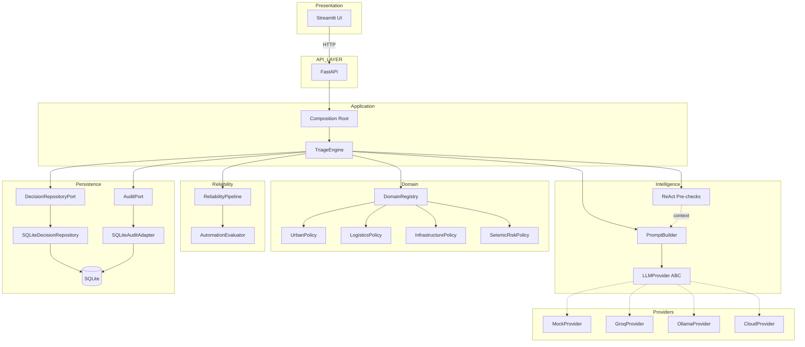
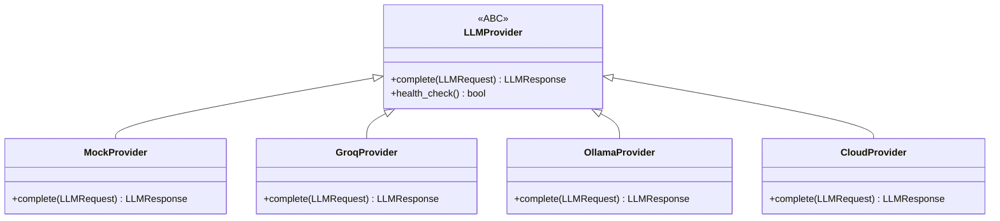
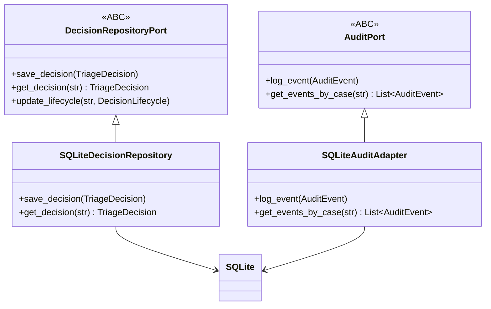
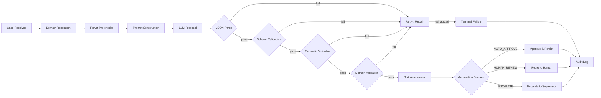

<p align="center">
  
</p>

<h1 align="center">CASE</h1>
<h3 align="center">Case Assessment and Structured Evaluation</h3>

<p align="center">
  Conservative AI decision orchestration for operational workflows.
</p>

<p align="center">
  <a href="https://github.com/juandelaf1/CASE/releases/tag/v1.0.0"></a>
  <a href="https://opensource.org/licenses/MIT"></a>
  
  
  
</p>

<p align="center">
  <strong>692 passed (deterministic) · 7 skipped · 0 failed</strong><br>
  <sub>ruff 0 errors · mypy 0 errors · 93 source files</sub><br>
  <sub>Live tests (Groq/Ollama): require API key and running server</sub>
</p>

---

## What is CASE?

CASE is a domain-agnostic, provider-agnostic AI decision orchestration platform. It transforms unstructured operational cases into structured, validated, evidence-backed decisions — with human oversight enforced by design.

> **El LLM propone. CASE valida, evalúa y gobierna la decisión.**

The LLM generates a structured proposal. CASE then validates it, evaluates reliability and risk, determines the governance route, and enforces human oversight when appropriate. Raw model output is never trusted directly. Every decision passes through multi-stage validation, domain-specific policy checks, risk evaluation, and conservative routing before persistence.

**What CASE is:**
- A validation pipeline that never trusts raw LLM output
- A risk-based automation system with human oversight (HITL)
- A domain-agnostic framework supporting multiple operational domains
- An auditable decision system with full traceability

**What CASE is not:**
- Not a fine-tuned model or RAG system
- Not an agent framework
- Not a production deployment
- Not an autonomous decision-maker

---

## Why CASE?

Large language models are probabilistic systems. Their output can be inconsistent, hallucinated, or subtly wrong in ways that are difficult to detect automatically. Directly routing raw LLM output to operational decisions introduces unacceptable risk.

CASE addresses this by introducing a structured orchestration layer:

1. **Receive** an operational case with evidence
2. **Obtain** a model proposal via the LLM provider port
3. **Validate** the output through schema, semantic, and domain constraints
4. **Retry** on transient and validation failures with exponential backoff
5. **Evaluate** automation risk using domain-specific policies
6. **Route** to the appropriate outcome: auto-approve, human review, or escalation
7. **Persist** the decision with full audit trail
8. **Enable** human override at any point in the lifecycle

The architectural insight is that **uncertainty should increase human involvement, not decrease it**. When confidence drops, evidence is thin, or risk rises, CASE routes toward human judgment rather than automated action.

---

## Core Design Principles

| Principle | Implementation |
|-----------|---------------|
| **Hexagonal architecture** | Ports and Adapters pattern — core logic depends on ABC interfaces, not implementations |
| **Provider neutrality** | LLM providers implement `LLMProvider` port; swapping requires zero core changes |
| **Domain-policy abstraction** | Each domain registers a `DomainPolicy` and `AutomationPolicy`; core remains domain-agnostic |
| **Contract-driven validation** | All data flows through Pydantic v2 schemas with strict type enforcement |
| **Reliability pipeline** | Multi-stage validation: parse → schema → semantic → domain → retry → repair |
| **Risk-based routing** | Three outcomes: `AUTO_APPROVE`, `HUMAN_REVIEW`, `ESCALATE` — conservative by default |
| **Human-in-the-loop** | Full decision lifecycle with approve, reject, modify, and escalate operations |
| **Auditability** | Every event logged through `AuditPort` with full traceability |
| **Deterministic evaluation** | Synthetic evaluation with reproducible metrics, no external dependencies |
| **Counterfactual invariance** | Bias testing verifies decisions remain stable across irrelevant attribute changes |

---

## Architecture



> **Connected vs. Isolated:** This diagram shows the **connected execution path** — components wired via `composition.py` and executed by `TriageEngine`. Dashed lines indicate that providers are alternative implementations of the `LLMProvider` ABC, selected at startup via `CASE_PROVIDER` env var. CASE also contains implemented and tested modules that are **not** connected to this pipeline. See [Project Status](#project-status) for the complete distinction.





---

## Decision Flow



### Decision Routing

| Outcome | Condition | Behavior |
|---------|-----------|----------|
| `AUTO_APPROVE` | Low risk, valid schema, high confidence, sufficient evidence | Decision persisted, audit logged |
| `HUMAN_REVIEW` | Medium risk, ambiguous evidence, confidence below threshold | Routed to human review queue |
| `ESCALATE` | Critical risk, policy violation, schema failure after retries | Escalated to supervisor |

**Conservative by design:** When uncertainty or risk increases, CASE prefers human review over automation. The system is designed to err on the side of caution.

---

## Project Status

> Verified against repository state. Last checked: 2026-09-17.

### Connected Core

These components are wired into the running system via `composition.py` and `TriageEngine`:

| Component | Location | Status |
|-----------|----------|--------|
| Contracts (Pydantic v2 schemas) | `contracts/` | Connected |
| Ports (6 ABC interfaces) | `ports/` | Connected |
| DomainRegistry (4 domains) | `domain/registry.py` | Connected |
| TriageEngine | `application/engine.py` | Connected |
| ReliabilityPipeline | `reliability/pipeline.py` | Connected |
| AutomationEvaluator | `reliability/automation.py` | Connected |
| ReAct pre-checks | `react/__init__.py` | Connected |
| PromptBuilder | `prompts/builder.py` | Connected |
| MockProvider (default) | `providers/mock.py` | Connected |
| GroqProvider | `providers/groq.py` | Connected |
| OllamaProvider | `providers/ollama.py` | Connected |
| CloudProvider | `providers/cloud.py` | Connected |
| CostModel | `evaluation/cost.py` | Connected |
| SQLite persistence | `case_infra/persistence/` | Connected |
| FastAPI API (11 endpoints) | `case_api/api/v1/app.py` | Connected |
| Streamlit UI | `streamlit_app/` | Connected |
| Evaluation framework | `evaluation/` | Connected |

### Implemented but Isolated

These modules are implemented, tested, but **not wired** into the main pipeline:

| Module | Files | Tests | Purpose |
|--------|-------|-------|---------|
| Logistics Intelligence | 8 files in `domain/` | 26 | Shipment classification, routing, carrier matching |
| ML Adaptation | 7 files in `ml/` | 26 | Training abstractions, dataset pipeline |
| Specialist Models | 2 files in `ml/` | 21 | Keyword-based classification/risk/routing |
| Hybrid Decision Engine | 1 file in `hybrid/` | 18 | Multi-source decision combination |
| Real Estate Domain | 1 file in `domain/` | 28 | Domain policy (not registered) |
| Governance | 1 file in `governance/` | 28 | Security, compliance, RBAC |
| Production | 1 file in `production/` | 28 | Circuit breaker, rate limiter, health checks |

These demonstrate the architecture's extensibility. Wiring them requires explicit architectural decision with documented justification.

---

## Quick Start

### Prerequisites

- Python 3.11+

### Setup

```bash
git clone https://github.com/juandelaf1/CASE.git
cd CASE
python -m venv .venv
source .venv/bin/activate        # Linux/Mac
# .venv\Scripts\activate         # Windows
pip install -e ".[dev]"
```

### Verify

```bash
pytest tests/ -q --ignore=tests/unit/test_streamlit_client.py
# Expected: 692 passed, 7 skipped

ruff check src
# Expected: All checks passed

mypy src --ignore-missing-imports
# Expected: Success: no issues found in 93 source files
```

### Run the API

```bash
uvicorn case_api.api.v1.app:app --reload --host 0.0.0.0 --port 8000
# API docs: http://localhost:8000/docs
```

### Run the UI

```bash
streamlit run streamlit_app/app.py
```

### Run a Demo

```bash
python examples/demo_auto_approve.py
```

---

## Demo Guide — 5/10 Minutes

### Step 1 — Decision Center

Open Streamlit and navigate to Decision Center. The hero section explains:

> CASE no delega ciegamente la decisión al LLM.

Show the pipeline visualization: CASE_RECEIVED → LLM_PROPOSAL → RELIABILITY → RISK → GOVERNANCE → AUDIT.

### Step 2 — Triage con Groq

Execute a case in Triage with Groq provider. Show:

- **PROPUESTA DEL LLM** — raw LLM output with confidence, decision, urgency
- **GOBERNANZA CASE** — the governance route determined by CASE (AUTO_APPROVE / HUMAN_REVIEW / ESCALATE)

Explain: *el modelo propone; CASE valida y determina la ruta.*

### Step 3 — Mismo caso con Ollama

Repeat the same case with Ollama. Show that two providers can produce different results and CASE applies its governance pipeline over both.

### Step 4 — Comparison

Open Comparison, select EN VIVO tab. Execute the same input against Groq and Ollama. Show:
- resultado por separado
- confianza
- latencia (~255ms vs ~18s)
- tokens
- errores si los hubiera

### Step 5 — Human Review

Send a case to HUMAN_REVIEW. Execute an HITL action (approve/reject/modify/escalate).

### Step 6 — Audit Trail

Show the audit events generated by the HITL action. Show timestamps, actors, event types.

### Step 7 — Control Room

Show real health checks for FastAPI, SQLite, Groq, Ollama. Show decision metrics by lifecycle.

### Demo Scripts

The `examples/` directory contains deterministic demo scripts:

| Script | Scenario | Expected Outcome |
|--------|----------|------------------|
| `demo_auto_approve.py` | Low-risk logistics case | AUTO_APPROVE |
| `demo_human_review.py` | Ambiguous case | HUMAN_REVIEW |
| `demo_escalate.py` | Critical case | ESCALATE |
| `demo_invalid_output.py` | Empty evidence | Terminal failure (domain validation) |
| `demo_hitl_lifecycle.py` | Full HITL workflow | Approve → Reject → Modify |
| `demo_all_domains.py` | All 4 domains | Domain-specific routing |

```bash
python examples/demo_auto_approve.py
```

---

## API Endpoints

| Endpoint | Method | Description |
|----------|--------|-------------|
| `/health` | GET | Health check |
| `/domains` | GET | List registered domains |
| `/api/v1/triage` | POST | Submit a case for triage |
| `/api/v1/audit/{case_id}` | GET | Get audit events for a case |
| `/api/v1/hitl/pending` | GET | List decisions pending human review |
| `/api/v1/hitl/{decision_id}` | GET | Get a specific decision |
| `/api/v1/hitl/{decision_id}/under-review` | POST | Start human review |
| `/api/v1/hitl/{decision_id}/approve` | POST | Approve a decision |
| `/api/v1/hitl/{decision_id}/reject` | POST | Reject a decision |
| `/api/v1/hitl/{decision_id}/escalate` | POST | Escalate a decision |
| `/api/v1/hitl/{decision_id}/modify` | POST | Modify a decision |

---

## Evaluation

CASE includes a deterministic evaluation framework for measuring decision quality.

### Scope

- **Evaluation** (streamlit_app/views/evaluation.py) → synthetic data with MockProvider
- **Counterfactual** (streamlit_app/views/counterfactual.py) → controlled bias testing
- **Comparison LIVE** (streamlit_app/views/comparison.py) → real providers when available

Synthetic evaluations and MockProvider results are clearly labeled as SIMULADO / EN VIVO in the UI. No mock result is presented as live.

### Metrics

- Decision accuracy
- Urgency accuracy
- Average confidence
- Processing time
- Error rate
- Pair consistency rate (bias)
- Decision invariance rate (bias)
- Routing invariance rate (bias)

### Bias Evaluation

10 counterfactual pairs test whether irrelevant attribute changes (supplier name, customer name, wording) alter decision outcomes. Currently covers the Logistics domain only.

### Scope

Evaluation uses synthetic data with MockProvider. Results demonstrate architectural correctness, not production accuracy. Real LLM validation is performed separately via LIVE comparison.

---

## Providers

| Provider | Type | Use Case | E2E Verified | Selection |
|----------|------|----------|-------------|-----------|
| MockProvider | Deterministic | Testing, demo, evaluation | Yes (unit tests) | `CASE_PROVIDER=mock` (default) |
| GroqProvider | Cloud API | Real inference (qwen/qwen3.8-27b) | Yes (LIVE) | `CASE_PROVIDER=groq` |
| OllamaProvider | Local LLM | Development, offline comparison | Yes (LIVE) | `CASE_PROVIDER=ollama` |
| CloudProvider | OpenAI-compatible | Production (GPT-4o-mini) | Implementation correct | `CASE_PROVIDER=cloud` |

All providers implement the `LLMProvider` port. Provider is selected at startup via `CASE_PROVIDER` env var. Swapping providers requires zero changes to core logic.

### Provider Comparison (Academic Requirement)

The Comparison view (`streamlit_app/views/comparison.py`) supports comparing decisions across providers. For live comparison:

1. **Groq**: Run triage with `CASE_PROVIDER=groq` — real API inference
2. **Ollama**: Run triage with `CASE_PROVIDER=ollama` — requires local Ollama server

The Comparison view automatically groups decisions by provider and displays:
- Classification result (approve/reject/escalate)
- Urgency level
- Confidence score
- Token usage and cost
- Latency

### Observed Performance (LIVE)

| Provider | Model | Latency | Notes |
|----------|-------|---------|-------|
| Groq | qwen/qwen3.8-27b | ~255ms | Cloud API, low latency |
| Ollama | llama3.2 | ~18s | Local, higher latency |

Both providers produced valid structured decisions for the same input. CASE applies its governance pipeline regardless of provider latency or source.

### Switching Providers

```python
from case_core.composition import create_app_dependencies
from case_core.providers.ollama import OllamaProvider
from case_core.providers.cloud import CloudProvider

# In composition.py, replace:
#   provider = MockProvider()
# with:
#   provider = OllamaProvider(model="llama3.2")
# or:
#   provider = CloudProvider(api_key="your-key")
```

---

## Domains

| Domain | Policy | Routing | Automation |
|--------|--------|---------|------------|
| **Logistics** | Full | 6 incident types | LogisticsAutomationPolicy |
| **Urban Operations** | Partial | Keyword urgency | DefaultAutomationPolicy |
| **Infrastructure** | Partial | Keyword urgency | DefaultAutomationPolicy |
| **Seismic Risk** | Partial | USGS API | SeismicAutomationPolicy |

### Logistics Domain Pack

- **Incident Types:** delivery_delay, delivery_failure, stock_issue, warehouse_delay, damaged_goods, transport_disruption
- **Departments:** logistics, warehouse, fleet, operations, customer_service
- **Automation:** Full risk-based automation with domain-specific rules

### Urban Operations & Infrastructure

- Evidence validation: requires evidence items
- Urgency classification: keyword-based
- Automation: DefaultAutomationPolicy (conservative, `HUMAN_REVIEW` default)

---

## Testing

### Quality Snapshot

| Check | Result |
|-------|--------|
| pytest (deterministic) | 692 passed, 7 skipped, 0 failed |
| ruff | 0 errors (src) |
| mypy | 0 errors (93 source files) |

### Test Classification

| Category | Suites | Description |
|----------|--------|-------------|
| Unit | domain, triage_engine, prompt_builder, reliability | Core pipeline tests |
| Contract | contracts, ports, mock_provider, ollama_provider, cloud_provider | Interface/schema validation |
| Integration | api, ollama_integration | End-to-end API tests |
| Behavioral | behavioral | 30 behavioral scenarios (BS001-BS030) |
| Security | security | 31 tests, 10 attack scenarios |
| Bias | bias_evaluation | Counterfactual pair analysis |
| Regression | regression | Normal, edge, failure, injection cases |
| Persistence | sqlite | SQLite adapter tests |
| Boundary | streamlit_boundary | Streamlit integration boundary |
| Isolated | governance, hybrid_decision, ml_adaptation, production, real_estate_domain, specialist_models | Tests for isolated modules |

### Running Tests

```bash
# All tests
pytest tests/ -q --ignore=tests/unit/test_streamlit_client.py

# Specific suite
pytest tests/unit/test_behavioral.py -v

# With coverage
pytest tests/ --cov=src --cov-report=term-missing
```

---

## Limitations

### Scope (by design)

| Limitation | Status | Notes |
|------------|--------|-------|
| Portfolio/research project | By design | Not a production system |
| No authentication/authorization | By design | Not needed for demo scope |
| No performance/load testing | By design | Not needed for demo scope |
| SQLite only | By design | Single-tenant, no concurrent access |

### Evaluation

| Limitation | Status | Impact |
|------------|--------|--------|
| MockProvider as primary evidence source | Active | All evaluations use synthetic responses |
| Real LLM behavior not validated | Active | Security/bias tested only with MockProvider |
| Bias pairs logistics-only | Active | 0 pairs for Urban/Infrastructure |
| Synthetic dataset (15 cases) | Active | Demonstrates framework, not production accuracy |

### Domain Coverage

| Limitation | Status | Impact |
|------------|--------|--------|
| Generic automation for Urban/Infrastructure | Active | DefaultAutomationPolicy, not domain-specific |
| No Urban/Infrastructure routing logic | Active | Uses keyword urgency classification only |

### Known Issues

| Issue | Status | Impact |
|-------|--------|--------|
| Audit trail duplicate `CASE_RECEIVED` | Observed | Engine logs case receipt twice in one flow. Cosmetic, does not affect correctness. |
| Groq `response_schema={}` fails | Pre-existing | Groq requires "json" in messages for json_object format. Real CASE schemas work correctly. |
| Ollama latency significantly higher than Groq | By design | Local vs cloud. Useful for architecture comparison, not a defect. |

### Isolated Modules

The following modules are implemented and tested but **not connected** to the running pipeline:

| Module | Description |
|--------|-------------|
| Logistics Intelligence | Shipment classification, routing, carrier matching |
| ML Adaptation | Training abstractions, dataset pipeline |
| Specialist Models | Keyword-based classification/risk/routing |
| Hybrid Decision Engine | Multi-source decision combination |
| Real Estate Domain | Domain policy (not registered in DomainRegistry) |
| Governance | Security, compliance, access control |
| Production | Circuit breaker, rate limiter, health checks |

These are not broken or incomplete. They are standalone implementations that demonstrate architectural extensibility. Wiring them requires explicit decision.

---

## Project Structure

```text
CASE/
├── src/
│   ├── case_core/
│   │   ├── application/     # TriageEngine (orchestrator)
│   │   ├── contracts/       # Pydantic v2 schemas (9 files)
│   │   ├── domain/          # DomainRegistry, DomainPacks
│   │   ├── evaluation/      # Runner, metrics, reports
│   │   ├── ports/           # ABC interfaces (6 ports)
│   │   ├── prompts/         # PromptBuilder
│   │   ├── providers/       # Mock, Ollama, Cloud
│   │   ├── reliability/     # Pipeline, automation evaluator
│   │   └── composition.py   # Dependency wiring
│   ├── case_api/
│   │   └── api/v1/          # FastAPI endpoints
│   └── case_infra/
│       └── persistence/     # SQLite adapters
├── tests/
│   ├── unit/                # 18 test files
│   └── integration/         # 2 test files
├── examples/                # 6 demo scripts
├── streamlit_app/           # Streamlit UI
├── docs/                    # Architecture, status, roadmap
├── pyproject.toml           # Project configuration
└── README.md                # This file
```

---

## Documentation

| Document | Purpose |
|----------|---------|
| [ARCHITECTURE.md](docs/ARCHITECTURE.md) | Technical architecture and layer descriptions |
| [DEVELOPMENT_STATUS.md](docs/DEVELOPMENT_STATUS.md) | Detailed implementation state and test matrix |
| [ROADMAP.md](docs/ROADMAP.md) | Phases, milestones, and future planning |
| [DECISION_LOG.md](docs/DECISION_LOG.md) | Record of significant technical decisions (D001-D010) |
| [CAPABILITY_AUDIT.md](docs/CAPABILITY_AUDIT.md) | Audit of isolated modules with integration proposals |
| [CHANGELOG.md](CHANGELOG.md) | Complete version history |
| [RELEASES.md](docs/RELEASES.md) | Release milestones and status |
| [AGENT_CONTEXT.md](docs/AGENT_CONTEXT.md) | Repository state for AI agents and contributors |

---

## Presentation

The academic project presentation is available at:

[`docs/presentation/CASE_Decision_Architecture.pptx`](docs/presentation/CASE_Decision_Architecture.pptx)

## Presentación

La presentación académica del proyecto está disponible en:

[`docs/presentation/CASE_Decision_Architecture.pptx`](docs/presentation/CASE_Decision_Architecture.pptx)

---

## Configuration

### Environment Variables

| Variable | Default | Description |
|----------|---------|-------------|
| `CASE_PROVIDER` | `mock` | LLM provider: `mock`, `groq`, `ollama`, `cloud` |
| `CASE_DB_PATH` | `case_audit.db` | SQLite database path |
| `OLLAMA_BASE_URL` | `http://localhost:11434` | Ollama server URL |
| `OLLAMA_MODEL` | `llama3.2` | Ollama model name |
| `CASE_GROQ_API_KEY` | — | Groq API key (required for `groq`) |
| `CASE_CLOUD_API_KEY` | — | Cloud provider API key (required for `cloud`) |

---

## License

MIT — See [LICENSE](LICENSE) for details.
